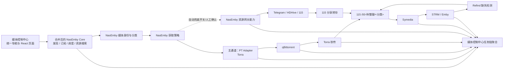

# PT 主链与云盘辅助通道订阅中枢整合计划

状态：架构原则保留，实施细节已由 `2026-07-14-nasemby-source-merge-design.md` 覆盖；iframe 与独立页面方案已排除
日期：2026-07-14  
范围：只做架构、迁移和验收计划，不进入代码实现

## 0. 最新决策覆盖

用户已明确：`D:\Projects\NasEmby_friend_clean\NasEmby_friend_clean_20260630_171606` 是可运行项目，订阅与发现不得在媒体控制中心内重新实现或猜测接口。后续以 NasEmby 的 Python/Flask 源码、API、数据文件、调度器和前端行为作为唯一业务依据；发现缺陷时直接修复 NasEmby 源码并记录补丁。

因此，本设计中另建 TypeScript `Subscription Service`、通过 iframe 嵌入或把 NasEmby 保持为用户可见独立页面的内容不再执行。下一轮设计要制定源码级合并边界：保留 NasEmby 的 Python 业务逻辑和数据语义，把发现、订阅、日历和资源搜索内容合入中控 React 页面，并让任务链消费同一份订阅台账。确认新架构前：

- 停止扩展中控现有 TypeScript 订阅与发现业务逻辑。
- 不删除现有过渡代码和数据，先做差异与迁移审计。
- 不允许 NasEmby 与中控两套调度器同时写订阅或同时推送 Torra。
- 真实 Torra、115、Symedia 写操作继续保持关闭。

## 1. 目标

把媒体控制中心建设为唯一订阅中枢。订阅自动化主要依赖 PT/Torra，云盘能力作为人工补资源和可选兜底工具：

1. 主链：媒体控制中心 → Torra → qBittorrent → Torra 秒传 → 115。
2. 辅助通道：媒体控制中心 → Telegram / HDHive 资源搜索 → 115 分享转存。

所有新建订阅和自动榜单订阅默认使用 `pt_only`。自动云盘兜底通过独立开关按需启用，只在 PT 未命中或明确失败后参与；开关关闭时仍允许用户从资源搜索中人工确认云盘获取。

两条通道最终都必须进入同一条下游链路：

```text
115 /00-待整理/<分类>
→ Symedia 识别、命名、洗版和归档
→ STRM
→ Emby
```

Refind 保持缺失检测和补充资源职责，不成为主订阅来源。

## 2. 核心原则

- NasEmby 是订阅、发现、资源搜索、策略、调度和推送的唯一业务数据源；媒体控制中心不维护第二套订阅规则。
- Torra 继续负责 PT 搜索、版本控制、权重排序、qB 下载和秒传，不在中控重复实现。
- Symedia 继续负责下游识别、归档、洗版、STRM 和 Emby 联动，不把它改造成总调度器。
- Telegram、HDHive 和 115 客户端能力直接沿用 NasEmby 已验证源码，通过开关控制，不另建一套重复网关。
- 两条通道共用同一套媒体身份、分类、去重和任务状态模型。
- PT 是默认主通道；自动云盘兜底默认关闭，启用后也不得与 PT 对同一媒体单元并行获取。
- 云盘能力不参与日常订阅发现和默认调度，不得成为系统首页和工作页的主要叙事。
- 先实现可观测、可回滚的单步流程，再开放自动化和兜底策略。
- 任何自动转存、自动推送和批量迁移默认关闭，必须通过验收闸门后单独启用。

## 3. 本期范围

### 纳入

- 统一订阅台账和媒体身份。
- 手动订阅、榜单订阅、全球日播和旧数据导入。
- PT 获取通道及 Torra 分类路径修复。
- Telegram 频道资源搜索。
- HDHive 授权、搜索、解锁和积分/频率保护。
- 115 分享转存，并按媒体分类进入对应待整理目录。
- 精准资源规则。
- PT 优先、云盘兜底策略及自动兜底开关。
- 订阅、获取、下载、秒传、入库和 Emby 状态聚合。
- 活动日志、失败原因、重试记录和人工操作入口。

### 暂不纳入

- 自研 PT 站点适配和种子搜索。
- 替代 Torra 的版本控制或下载器逻辑。
- 替代 Symedia 的媒体识别、洗版和 STRM。
- 网页播放、刮削器、字幕系统。
- 115 删除、清空回收站、批量清理等高风险能力。
- MoviePilot 主通道。保留未来适配位置，但第一阶段不接入。
- 同时运行多套自动获取策略。首版每条订阅只能有一个主策略。

## 4. 目标架构



## 5. 组件边界

### 5.1 NasEmby Subscription Service

负责：

- 保存用户真正想追踪的电影或剧集季。
- 区分手动、自动榜单、全球日播和导入来源。
- 保存获取策略、启用状态、目标季和优先级。
- 管理屏蔽、暂停、完成和归档状态。

不负责：

- 搜索种子、下载文件、操作 115 或执行媒体归档。

### 5.2 NasEmby Identity & Category Resolver

负责把不同来源统一为：

- `mediaType`
- `tmdbId`
- `seasonNumber`
- 标准标题和年份
- `mediaCategory`

分类必须与现网 8 条链路一致：

| 统一分类 | qB 保存目录 | 115 待整理目录 |
|---|---|---|
| 日漫 | `00-日漫` | `00-日漫` |
| 国漫 | `01-国漫` | `01-国漫` |
| 国产剧 | `02-国产剧` | `02-国产剧` |
| 日韩剧、南亚剧 | `03-日韩剧` | `03-日韩剧` |
| 欧美剧、欧美动画 | `04-欧美剧` | `04-欧美剧` |
| 港台剧 | `05-港台剧` | `05-港台剧` |
| 综艺 | `06-综艺` | `06-综艺` |
| 电影 | `10-电影` | `10-电影` |

无法可靠分类的条目不得自动推送，必须等待人工选择；不重新引入 `99-未分类` 自动入口。

### 5.3 NasEmby Acquisition Orchestrator

负责：

- 根据订阅策略创建幂等获取任务。
- 控制主通道、兜底通道、超时和重试。
- 防止同一媒体在 Torra、Telegram 和 HDHive 同时重复获取。
- 记录每次候选搜索、推送、转存和失败原因。

首版支持三种策略：

| 策略 | 行为 |
|---|---|
| `track_only` | 只做日历和库内进度，不获取资源 |
| `pt_only` | 只推送 Torra |
| `pt_then_cloud` | 先走 Torra；PT 未命中或确认终止失败且自动云盘兜底开关已启用时，才进入云盘兜底 |

默认策略始终是 `pt_only`。自动榜单、全球日播和旧订阅迁移不得自行改成 `pt_then_cloud`；只有用户明确启用全局开关并对订阅允许兜底时才使用混合策略。

首版不提供 `cloud_then_pt`。云盘通道不能抢在 PT 前面自动执行，也不能与 PT 并行获取同一媒体单元。

云盘开关分两层：

- 全局 `cloud_fallback_enabled`：控制 Resource Gateway 是否参与自动兜底，初始值为关闭。
- 订阅级 `cloud_fallback`：`inherit`、`enabled`、`disabled`；默认继承全局设置。

手动资源搜索不受自动兜底开关限制，但执行 115 转存前仍需用户确认并做重复状态检查。

### 5.4 Torra Adapter

负责：

- 查询现有 Torra 订阅并建立绑定。
- 推送或更新订阅。
- 触发搜索。
- 读取下载记录和运行状态。

上线前必须解决：

- `save_path` 必须由统一分类明确写入 `/vol02/1000-4-32d3f6a0/torra/<分类>`。
- 不允许继续发送空 `save_path`。
- 验证 Torra 是否允许继承默认下载器、站点和版本规则；不能确认时必须显式选择模板。
- `is_anime`、季号和总集数必须来源于统一媒体身份。
- 对现有 Torra 订阅执行查重和绑定，不重复创建 `mcc_*` 订阅。

### 5.5 NasEmby Resource Gateway

直接使用 NasEmby 已有 Python 3.13 运行环境和源码，原因：

- HDHive 模块是 Python 3.13 字节码并依赖 PyArmor 运行时，无法直接移植到 Node.js。
- Telethon、p115client 和现有 HDHive 运行时已经在 Python 侧验证。
- NasEmby 已经能够运行，并同时持有订阅、发现、资源搜索、授权和转存所需状态；再次拆分会制造重复数据源。

NasEmby 资源网关部分负责：

- Telegram 登录和会话。
- Telegram 频道搜索。
- HDHive 授权、签到、搜索和解锁。
- 115 账号检查、分享转存。
- 返回规范化候选和操作结果。

Resource Gateway 不负责：

- 保存订阅。
- 自己定时扫描订阅。
- 自己决定使用 PT 还是云盘。
- 保存媒体任务最终状态。

Resource Gateway 只持久化运行所必需的 Telegram session、HDHive 安装绑定和限流状态，使用独立数据卷；这些运行状态不能成为订阅主数据。

### 5.6 媒体控制中心任务链聚合

负责汇总：

- 中控订阅和获取任务。
- Torra 订阅、下载记录和秒传任务。
- qB 实时任务。
- Resource Gateway 搜索、解锁和转存结果。
- Symedia TransferHistory。
- Emby 库内结果。

统一展示四步主链：

```text
订阅 → 获取/下载 → 进入 115 → 入库
```

其中“进入 115”允许显示证据等级：

- 已验证：存在秒传/转存成功记录。
- 推断：下载完成但尚未出现 Symedia 记录。
- 失败：秒传或 115 转存明确失败。

## 6. 数据模型

完整合并前，将当前 JSON 存储迁移到 SQLite。凭据仍通过环境变量或独立密钥文件提供，不写入业务数据库。

### `subscriptions`

- `id`
- `media_type`
- `tmdb_id`
- `season_number`
- `title`
- `year`
- `media_category`
- `policy`
- `cloud_fallback`
- `status`
- `enabled`
- `created_at`
- `updated_at`

唯一键建议：`media_type + tmdb_id + season_number`。电影的季号为空。

### `subscription_sources`

记录一个订阅来自手动、豆瓣榜单、全球日播或旧系统导入。一个订阅允许对应多个来源，避免因自动榜单刷新删除用户手动意图。

### `provider_bindings`

保存订阅与外部任务的绑定：

- Torra subscription ID
- Symedia task ID（仅兼容或人工选择时使用）
- Resource Gateway job ID

### `acquisition_jobs`

保存一次获取任务的主状态、当前通道、兜底状态、幂等键、开始时间和结束时间。

### `acquisition_attempts`

保存每次搜索、候选匹配、解锁、Torra 推送或 115 转存尝试。

### `resource_candidates`

保存经过脱敏的候选元数据、来源、格式标签、大小、季集和匹配结果。完整 Cookie、Token 和授权响应不得入库。

### `pipeline_events`

保存链路事件，供任务中心、活动日志和故障回溯使用。

## 7. 产品界面与接口边界

### UI 保护边界

以下两部分保持当前视觉、布局和交互，不纳入双通道改版：

- 影院大厅：`MediaHall`、Mineradio iframe、媒体队列、视觉特效、滚轮/方向键和媒体选择交互。
- 顶部导航栏：保持当前胶囊外观、位置、尺寸、图标、字号、间距、激活样式和响应式行为。

顶部导航继续使用现有入口：总览、影院大厅、控制室、任务中心、日历、发现，以及现有设置按钮。不新增顶级导航项。“订阅中心”并入发现页内部，通过页面内标签或分区访问。

允许变化的是导航中展示的实时数据，例如健康服务数量；不修改导航的 DOM 结构、视觉语言和交互模式。所有新增样式必须限定在工作页作用域，不能污染影院大厅和顶部导航。

### 页面落点

- 总览：以 PT 主链为核心，展示 Torra 订阅、qB 下载、秒传、最近入库、失败和待人工处理项。只有云盘兜底已启用、正在执行或发生异常时才显示云盘摘要。
- 发现页：默认进入“内容发现”，订阅按钮默认创建 PT 订阅；内部提供“我的订阅”，云盘“资源搜索”作为次级工作区按需打开。
- 任务中心：展示订阅、获取/下载、进入 115、入库四步链，以及 PT 尝试、云盘候选、兜底切换和失败记录。
- 控制室：Torra、qB、Symedia 和 Emby 作为核心服务优先展示；Resource Gateway、115 和 Refind 放入辅助服务区域，并提供安全的连接测试和原工具入口。
- 日历：保留月历主形态，增加订阅策略、获取状态、已入库、逾期未入库和失败提示。
- 设置页：增加自动云盘兜底总开关、默认获取策略、兜底等待条件、Telegram/HDHive/115 连接状态和非敏感规则；凭据继续通过环境变量或受保护的服务端配置提供。

不恢复旧 NasEmby 的独立首页、订阅页面和系统设置页面。

### 接口组

- `/api/subscriptions/*`：订阅台账、来源、分类、策略和外部绑定。
- `/api/acquisitions/*`：创建获取任务、暂停、人工重试和查看尝试记录。
- `/api/resources/*`：搜索、预览、候选规则检查和人工转存确认。
- `/api/tasks/chain`：统一任务链聚合。
- `/api/connectors/*`：连接状态和安全的只读能力探测。

前端不能直接调用 Torra、Symedia、115、Telegram 或 HDHive；所有外部调用必须经过服务端适配层。

## 8. 两条通道的数据流

### 8.1 PT 通道

1. 创建或更新订阅。
2. TMDB 身份和分类校验。
3. 查询 Emby，已完整入库则不推送。
4. 查询 Torra 是否已有同 TMDB、类型和季号订阅。
5. 已存在则建立绑定并按需要触发搜索；不存在则按分类模板创建。
6. Torra 推送 qB 分类下载目录。
7. file_event_mover 建立硬链接。
8. secupload_115 秒传到同分类 `/00-待整理`。
9. Symedia 归档，Emby 更新。

### 8.2 云盘独立或兜底通道

1. 用户从资源搜索人工发起云盘获取，或 `pt_then_cloud` 的 PT 尝试达到明确兜底条件。
2. 检查全局云盘开关和订阅级开关；自动兜底必须同时允许。
3. 再次核对 Torra、qB、115、Symedia 和 Emby，确认当前媒体仍未满足且没有活动 PT 下载。
4. Resource Gateway 并行搜索允许的 Telegram 频道和 HDHive。
5. 中控执行精准标题、季集、格式和排除规则。
6. 候选排序后选择第一条可安全转存资源。
7. HDHive 付费解锁必须同时通过积分上限和频率限制；自动模式默认不消费积分。
8. 115 分享转存到对应分类 PID，不允许统一转入一个无分类目录。
9. 转存成功后等待 Symedia 和 Emby 结果，并把当前媒体单元标记为已满足，阻止后续重复获取。
10. 请求超时、连接中断或结果未知必须先向 115 和任务记录做状态对账；不得直接重复转存。

`pt_then_cloud` 的自动兜底只有在系统能够阻止 Torra 对当前媒体单元继续重复获取时才能启用。若 Torra API 或本地绑定无法提供足够控制，云盘兜底只能保持人工确认模式。

## 9. 现有数据迁移

当前需要同时处理：

- 媒体控制中心本地 138 条订阅：自动 136 条、手动 2 条。
- Torra 当前约 194 条订阅。
- 旧 NasEmby 目录中的代码和空白配置模板；该目录没有可直接视为运行真值的订阅数据。

迁移规则：

1. 迁移前备份当前 JSON、SQLite（如有）和 Torra 订阅列表。
2. 先导入媒体控制中心本地订阅，保留手动/自动来源。
3. 再读取 Torra 订阅，按 TMDB ID、类型、季号建立绑定。
4. Torra 已有的订阅不重新创建，也不修改路径，先标记为“已绑定待审计”。
5. 标题匹配但 TMDB 不同的条目进入冲突清单，不自动合并。
6. 自动订阅快照不得删除手动订阅来源。
7. 完成迁移后保持所有自动获取策略关闭，只开放查询和人工单条验证。

## 10. 分阶段实施计划

发布里程碑：

- PT 核心版：完成阶段 0 至阶段 3，即可作为主要订阅中枢上线。
- 云盘人工辅助版：完成阶段 4 和阶段 5，增加人工搜索和转存，但不自动兜底。
- 云盘自动兜底版：阶段 6 属于可选增强，只有 PT 主链稳定且防重复能力验证通过后才启用。

### 阶段 0：冻结与证据快照

产出：

- 当前数据、配置和外部订阅快照。
- 138 条本地订阅和 Torra 订阅的差异报告。
- 8 分类路径、Torra 模板、115 分类 PID 对照表。

验收：

- 任意迁移失败都能恢复原 JSON 和配置。
- 不触发 Torra 搜索、不转存 115、不修改外部任务。

### 阶段 1：统一身份、分类和 Torra 安全推送

产出：

- 中央媒体身份与分类解析规则。
- Torra 分类模板和查重绑定规则。
- 单条订阅 dry-run 预览。

验收：

- 8 类媒体均得到正确 qB 保存路径。
- 推送载荷不再出现空 `save_path`。
- 一条测试订阅可走完 qB 分类目录 → 秒传目录 → 115 分类目录。
- 已有 Torra 订阅不会重复创建。

回滚：

- 关闭中控推送开关，恢复只读模式。

### 阶段 2：SQLite 订阅主数据

产出：

- SQLite 表结构和 JSON 迁移工具。
- 订阅来源、外部绑定和迁移审计记录。
- 旧 JSON 只读备份。

验收：

- 138 条本地订阅数量、手动来源和关键字段一致。
- 重复执行迁移不会重复数据。
- API 并发读写不会造成文件覆盖。

回滚：

- 停止新写入并切回迁移前 JSON 快照。

### 阶段 3：真实任务链与事件模型

产出：

- `acquisition_jobs`、`attempts` 和 `pipeline_events`。
- Torra、qB、Symedia、Emby 聚合任务中心。
- 证据等级、卡住阈值和建议动作。

验收：

- 单条 PT 任务能看到订阅、下载、进入 115、入库全过程。
- 无法关联的外部任务明确显示“未关联”，不错误合并。
- 秒传推断状态明确标注为推断。

### 阶段 4：Resource Gateway 手动能力

产出：

- Python 3.13 无界面侧车。
- Telegram 登录、频道搜索。
- HDHive 授权、搜索、解锁保护。
- 115 单条转存。
- 中控资源搜索、预览和人工确认页面。

验收：

- Resource Gateway 重启不丢失 Telegram 会话和 HDHive 安装绑定。
- 不向中控返回 Cookie、Token 或完整授权响应。
- 人工选择一条免费或已解锁资源，可转入正确 115 分类目录并被 Symedia 接管。

回滚：

- 停止 Resource Gateway，不影响 PT 主链和现有媒体服务。

### 阶段 5：精准规则与云盘兜底准备

产出：

- 标题、季集、分辨率、动态范围、编码、扩展名、大小和关键词规则。
- 幂等、候选过期和失败上限。
- PT 状态核对和防重复前置检查。

验收：

- 不精准匹配的资源不会自动转存。
- 付费 HDHive 资源默认不会自动解锁。
- 同一订阅同时只能有一个活动获取任务。
- 自动转存失败不会无限重试。

### 阶段 6：PT 优先、云盘兜底

产出：

- `pt_then_cloud` 状态机。
- 全局自动云盘兜底开关和订阅级覆盖设置。
- PT 未命中、超时和明确失败条件。
- 从 PT 切换到云盘前的重复状态核对和 Torra 抑制机制。
- 云盘兜底搜索、转存和审计。

验收：

- 自动云盘兜底开关关闭时，订阅自动获取只执行 PT 通道；人工资源搜索和确认转存仍可使用。
- PT 正在下载、已经进入 115 或已经入库时绝不启动云盘兜底。
- PT 达到明确兜底条件后只切换一次云盘通道。
- 云盘转存成功后能够阻止 Torra 对当前媒体单元继续重复获取。
- 重启服务后不会重复执行已经完成的云盘兜底。
- 两条通道产生重复媒体时能够识别并停止后续动作。

### 阶段 7：通知、运维和上线保护

产出：

- 获取成功、失败、兜底和入库通知。
- 每日摘要与失败队列。
- 数据备份、恢复和升级流程。
- 中控访问控制和 API 保护。

验收：

- 通知不包含认证信息。
- VPS 部署时未配置访问密钥不得开放管理 API。
- 备份恢复演练可以恢复订阅、任务和外部绑定。

## 11. 风险闸门

以下条件未满足时不得开放自动获取：

1. Torra 分类路径尚未实机验证。
2. 115 八分类 PID 尚未核对。
3. Symedia 未能接管测试转存文件。
4. Emby 库内判断存在明显误判。
5. 现有 138 条订阅尚未完成审计。
6. Resource Gateway 仍会把敏感授权信息写入日志或返回前端。
7. 获取任务没有幂等键、失败上限或重启恢复机制。
8. 无法在云盘兜底前确认 PT 已停止或当前媒体仍然缺失。

## 12. 测试策略

### 单元测试

- 标题、TMDB、季号和分类解析。
- 订阅去重和多来源合并。
- 策略状态机。
- 精准资源规则。
- PT 失败到云盘兜底的单次性。

### 契约测试

- Torra 订阅列表、保存和运行接口。
- Resource Gateway 搜索与转存接口。
- Symedia TransferHistory。
- Emby TMDB ProviderId 和集数对照。

### 集成测试

- PT 单文件完整链路。
- Telegram 免费 115 分享完整链路。
- HDHive 已解锁资源完整链路。
- PT 未命中 → 云盘兜底。
- 服务重启后的任务恢复和防重复。

### 上线验收

- 先单条电影，再单条剧集季，最后才允许小批量。
- 自动任务首轮上限 3 条，连续稳定后再逐步放大。
- 每个阶段至少观察一个完整调度周期。

## 13. 完成定义

只有同时满足以下条件，才算双通道整合完成：

- 用户只在媒体控制中心维护订阅。
- 自动榜单和普通订阅默认全部进入 PT/Torra 主链。
- 每条订阅能明确看到使用的获取策略和当前通道。
- PT 和云盘通道都进入同一 115 分类与 Symedia 入库链路。
- 任务中心能够显示真实证据、失败原因和兜底过程。
- 不再依赖旧 NasEmby Web 页面、订阅 JSON 和调度线程。
- Resource Gateway 可以独立停用而不影响 PT 通道。
- 所有批量和自动动作都有开关、上限、审计和回滚方法。
