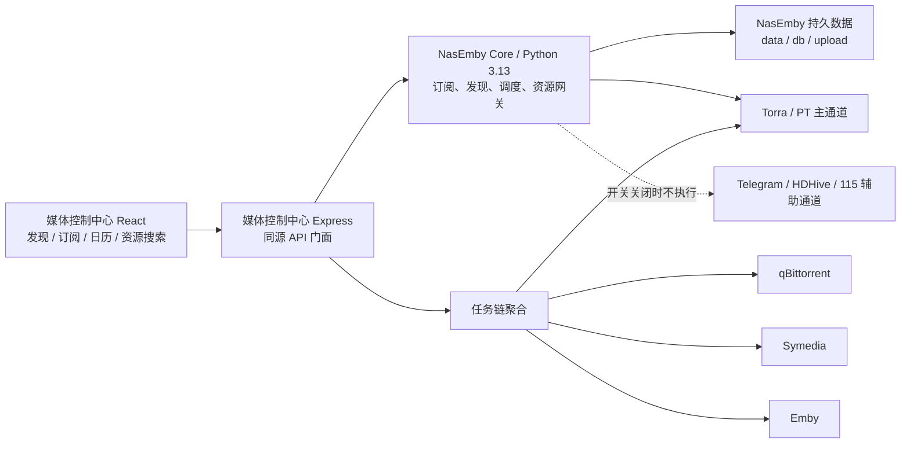

# NasEmby 订阅与发现源码合并设计

状态：已批准，实施中（阶段 0、2、3、4、5 已完成；阶段 1 仅余 Docker 运行时复验）
日期：2026-07-14
NasEmby 源码基线：`D:\Projects\NasEmby_friend_clean\NasEmby_friend_clean_20260630_171606`
审计依据：`docs/superpowers/specs/2026-07-14-nasemby-direct-integration-audit.md`

## 1. 目标

把 NasEmby 已能运行的订阅、发现、资源搜索、日历、自动调度和 Torra 推送能力合并进媒体控制中心。用户最终只使用媒体控制中心的一套地址、顶部导航和 React 页面，不看到 iframe、独立 NasEmby 页面或外部跳转。

“合并”不等于重新发明：

- Python 业务逻辑、数据结构、API 语义和调度行为以 NasEmby 源码为准。
- React 页面逐项吸收 NasEmby 原 `templates/index.html` 和 `static/app.js` 的内容与交互，不自行猜测字段或删减业务后再补。
- NasEmby 有 bug 时在合并后的 Python 源码中修复，并记录补丁来源、原因和测试。
- 当前中控 TypeScript 订阅实现只用于平滑迁移，最终不再作为业务数据源。

## 2. 不做的方案

- 不用 iframe 嵌入 NasEmby。
- 不把“发现”或“日历”跳转到 NasEmby 独立页面。
- 不让用户维护两套地址、导航或登录状态。
- 不把 NasEmby 全部业务重新翻译成 TypeScript。
- 不让两套订阅文件、调度器或 Torra 推送入口同时工作。
- 不修改影院大厅、媒体队列和顶部导航的现有视觉。

## 3. 目标架构

项目采用“一个用户界面、两个内部运行时、一个订阅数据源”：



NasEmby Core 的源码纳入媒体控制中心仓库，由同一 `docker-compose.yml` 管理，但作为内部 Python 进程或内部容器运行。浏览器不直接访问它；Express 提供同源门面、隐藏内部地址和凭据，并负责与现有任务链接口衔接。

这不是页面嵌入。页面由中控 React 渲染，NasEmby Core 只提供真实业务能力。

订阅业务配置使用独立“订阅设置”工作页，由内容发现中的“我的订阅”进入；系统设置只管理服务连接和全局安全策略。独立页仍直接消费 NasEmby Core 的 `mode`、`douban` 和 `resource_rules` 数据结构，不建立第二套前端配置模型。

## 4. 源码目录与所有权

计划将 NasEmby 源码纳入项目内独立目录，例如：

```text
services/nasemby-core/
  app/
  requirements.txt
  Dockerfile
  patches/
```

目录保留 NasEmby 原模块边界：

- `app/discover_runtime.py`：发现、订阅、日历、缓存、资源搜索和调度。
- `app/services.py`：Torra、Symedia、MoviePilot、Emby、115 等外部能力。
- `app/main.py`：内部 Flask API 和调度器启动。
- `app/config.py`：运行配置和 `data/user.env`。
- `app/telegram_runtime.py`、`app/hdhive/`：辅助通道能力。

媒体控制中心不复制这些函数到 `server/services/*.ts`。必要修改直接落在合并后的 Python 源码，并在 `patches/README.md` 记录与原基线的差异。

## 5. 唯一数据源

合并后以下文件是订阅真实数据：

- `db/discover_subscriptions.json`
- `db/discover_subscription_items.json`
- `db/discover_subscription_detail_cache.json`
- `data/user.env`
- NasEmby 原有活动日志和运行状态文件

用户从媒体控制中心创建的订阅直接写入上述 Core 文件；它们位于中控管理的 Docker 持久卷中，不从外部 NasEmby 实例迁移。中控现有 `data/subscriptions.json`、`data/subscription-config.json` 只作为未配置 Core 时的开发回退，不再接受生产写入。Core 启用后：

- React 订阅列表来自 NasEmby `/api/subscriptions/items`。
- 任务中心的订阅主干来自同一接口。
- 自动调度只由 NasEmby 执行。
- Torra 推送只从 NasEmby 路径发起。
- 中控活动日志可继续记录中控动作，但订阅业务日志读取 NasEmby 原日志。

## 6. API 门面

Express 增加 NasEmby 内部客户端，但不重新解释业务规则。门面职责仅限：

- 转发允许的请求和响应。
- 设置超时和统一的服务不可用状态。
- 隐藏内部服务 URL、Token、Cookie 和完整错误响应。
- 为现有任务链提供只读订阅快照。
- 在迁移期间提供旧前端到新契约的最小兼容层。

最终前端优先使用 NasEmby 原契约：

- `/api/discover/search`
- `/api/discover/tmdb`
- `/api/discover/douban`
- `/api/discover/platform-hot`
- `/api/discover/daily-airing`
- `/api/discover/resources/search`
- `/api/discover/resources/preview`
- `/api/subscriptions/config`
- `/api/subscriptions/items`
- `/api/subscriptions/detail`
- `/api/subscriptions/calendar`
- `/api/subscriptions/run|save|delete|block|unblock|clear`
- `/api/torra/subscribe`
- `/api/activity/logs`

若路由与中控现有 API 冲突，迁移期使用内部命名空间；切换完成后再让公开路由指向 NasEmby Core。

## 7. React 页面合并

### 7.1 发现页

保留媒体控制中心现有工作页壳层和视觉令牌，合并 NasEmby 原页面内容：

- 全球日播、TMDB、豆瓣、腾讯、优酷、爱奇艺、芒果。
- 海外流媒体 / JustWatch 作为同一“内容发现”页面内的并列来源标签，不增加独立页面或导航入口。
- 搜索、来源筛选、分页、海报、订阅状态。
- 资源搜索和资源预览。
- NasEmby 原订阅动作与错误反馈。

当前中控已有 JustWatch 查询逻辑不能作为第二套 Node 数据源长期保留，应迁入 NasEmby Core 后由原发现 API 返回。

### 7.2 我的订阅

恢复 NasEmby 原页面的完整内容：

- 电影订阅。
- 电视剧订阅。
- 被屏蔽订阅。
- 状态、更新时间、年份和关键词筛选。
- 详情、演职员、季集、入库路径。
- 搜索资源、推送 Torra、屏蔽、删除、复制标题。

MoviePilot 和 Symedia 推送入口是否显示由配置和项目边界控制，但后端行为不重写。

### 7.3 日历页

顶部导航中的“日历”继续存在，页面读取 NasEmby 原订阅日历 API。月历视觉可以保持中控当前样式，但条目、进度、类型切换、错误和日期计算以 NasEmby 响应为准。

## 8. JustWatch 合并

JustWatch 是“内容发现”页面中必须保留的正式来源，与 TMDB、豆瓣和国内平台来源并列，不是独立模块或独立页面。合并方式：

- 将当前已验证的 TMDB watch-provider 查询移入 NasEmby `discover_runtime.py`。
- 在 NasEmby 发现 API 增加海外流媒体来源和 provider 参数。
- 在合并后的 React 发现页增加海外流媒体来源标签和平台选择。
- 保留已经核对的 US 区平台与 provider ID。
- 订阅动作继续调用 NasEmby `/api/subscriptions/save`，不产生独立台账。

JustWatch 只负责内容发现，不成为新的获取通道；获取仍遵循 PT/Torra 优先和云盘开关。

## 9. Torra 与自动化安全

NasEmby 原 Torra 行为保持：查重、已有订阅合并保存、新订阅保存、触发搜索和活动日志。任何修正都在 Python 源码内完成。

实机验收前：

- `ENV_TORRA_AUTO_SUBSCRIBE=0`。
- 中控 `TORRA_PUSH_ENABLED=false`。
- NasEmby 的 Symedia、Telegram、115 自动动作保持关闭。
- 自动云盘兜底保持关闭。
- 前端写动作在未进入实机阶段时禁用或只连接模拟服务。
- 不执行真实 Torra 保存、搜索、115 转存或 Symedia 任务。

## 10. 分阶段迁移

### 阶段 A：源码纳入与只读启动

- 将 NasEmby 源码复制进媒体控制中心仓库。
- 保留原目录和依赖，不做业务重构。
- 使用副本数据启动内部 Python 服务。
- Express 只读探测状态、发现来源和订阅列表。

验收：原 NasEmby 测试数据可读取，中控现有功能不受影响，所有外部写开关关闭。

### 阶段 B：切换发现页读取

- React 发现页改读 NasEmby Core。
- 合并原发现筛选、资源搜索和预览。
- 把 JustWatch 迁入 NasEmby Core。

验收：NasEmby 原来源和 JustWatch 均可浏览；尚不开放真实写动作。

### 阶段 C：切换订阅与日历读取

- 我的订阅、详情、屏蔽列表和日历改读 NasEmby。
- 任务中心同时读取 NasEmby 订阅台账。
- 使用临时 Core 数据验证订阅身份、季号和只读契约，不导入外部台账。

验收：中控各页面看到同一订阅数量、媒体身份和季号。

### 阶段 D：切换写入

- 保存、删除、屏蔽、改配置、手动执行全部改为 NasEmby API。
- 保持真实 Torra 和云盘写入关闭，只验证模拟响应。
- 停止中控 TypeScript 订阅文件写入。

验收：所有订阅变更只落入 NasEmby 数据文件；旧 JSON 保持只读备份。

### 阶段 E：停止重复调度器

- 禁用 `AutoSubscribeRunner`。
- 清理重复的 Node 发现抓取和订阅推送引用。
- 保留必要兼容期后再删除无引用代码。

验收：只有 NasEmby 调度线程存在，不重复抓取、不重复推送。

### 阶段 F：实机闸门

- 用户确认测试窗口后再接真实 NasEmby 数据和外部服务。
- 先单条只读核对，再单条手动动作。
- 自动推送和云盘兜底最后开放。

## 11. 错误处理与回滚

- NasEmby Core 离线时，发现、订阅和日历显示“订阅引擎不可用”，不回退到旧 TypeScript 写入。
- 代理超时不自动重试写请求，避免重复订阅或转存。
- 读接口可做短时缓存，但必须显示数据时间。
- 每个阶段保留旧入口的只读回滚能力，不允许两套写入同时启用。
- 部署升级前备份中控管理的 Core `data/db/upload` 命名卷。
- 回滚时恢复路由指向和中控 Core 数据备份，不从外部台账猜测合并结果。

## 12. 测试与验收

自动测试使用 NasEmby 模拟响应和数据目录副本：

1. NasEmby Core 状态、超时和错误脱敏。
2. 各发现来源与 JustWatch 响应。
3. 订阅列表、详情、日历和屏蔽列表。
4. 保存、删除、屏蔽和配置只写 NasEmby 数据。
5. Torra 已有订阅与新订阅语义对齐源码。
6. 任务链使用 NasEmby 订阅主干。
7. `AutoSubscribeRunner` 停用后没有第二个调度器。
8. 外部写开关关闭时不调用 Torra、115、Symedia。
9. 发现、日历在桌面和移动端无横向溢出。
10. 影院大厅、媒体队列和顶部导航没有被修改。

## 13. 文档规则

- 每个 NasEmby 源码补丁记录原文件、修改原因、行为差异和验证方式。
- `docs/IMPLEMENTATION_SOURCES.md` 记录 NasEmby 文件到中控页面/API 的映射。
- 不把真实账号、密码、Cookie、Token、电话号码、频道信息或服务地址写入仓库。

实施步骤见：`docs/superpowers/plans/2026-07-14-nasemby-source-merge-implementation-plan.md`。
