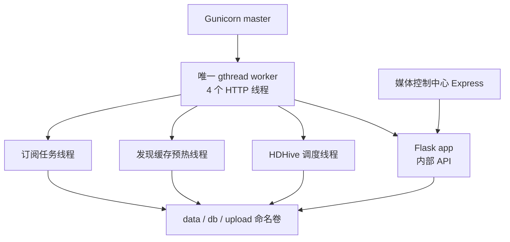

# NasEmby Core 生产运行时设计

状态：已批准，已实施
日期：2026-07-16
关联设计：`docs/superpowers/specs/2026-07-14-nasemby-source-merge-design.md`

## 1. 背景

NasEmby Core 空数据 Docker 复验已经通过：镜像可以构建，容器健康，`GET /api/status` 返回 200，`12388` 只在 Compose 内部网络暴露，九个外部自动动作环境变量均为关闭状态。

当前 Docker 入口仍是 `python -m app.main`，因此实际使用 Flask 自带开发服务器。它适合本地开发，但不作为正式 Docker 部署的长期运行方式。与此同时，HDHive 签到、发现缓存预热和订阅任务三个后台线程只在 `app.main` 的 `__main__` 分支启动。若仅把 Docker 命令替换为 Gunicorn，API 虽然可以工作，后台调度却不会启动；若直接使用多个 worker，每个 worker 又可能启动一套调度器，造成重复订阅、重复搜索或重复外部动作。

用户已选择方案 A：NasEmby Core 保持单容器、单 Web worker，使用多线程处理内部请求，并保证后台调度器在该 worker 内只启动一次。

## 2. 目标

- 用生产 WSGI 服务器替换 Flask 开发服务器。
- 保留 NasEmby 现有三个后台调度循环及其业务语义。
- 一个 Core 容器内始终只有一套调度器。
- 中控并发读取发现、订阅、日历和资源搜索时不会被单请求串行阻塞。
- Docker 停止或重启时不遗留独立调度子进程。
- 不改变订阅数据结构、API 契约、PT 优先策略或任何外部写开关。

## 3. 非目标

- 本阶段不拆分独立 scheduler 容器。
- 不支持多个 NasEmby Core 副本横向扩容。
- 不引入 Redis、数据库选主、分布式锁或任务队列。
- 不修改 Express、React、影院大厅、媒体队列或顶部导航。
- 不启用 Torra、115、Symedia、Telegram、HDHive 或 Emby 的真实写动作。
- 不顺带重构 NasEmby 的发现、订阅或 provider 业务逻辑。

## 4. 方案对比与决策

### 方案 A：单 worker Gunicorn，调度器同进程运行（采用）

Gunicorn master 管理一个 `gthread` worker。该 worker 使用四个线程处理内部 HTTP 请求，三个 NasEmby 后台调度线程仍在同一 worker 进程内运行。优点是改动小、数据访问模型与原 NasEmby 最接近，不需要跨进程锁，适合当前单机媒体中心。

### 方案 B：Web 与 scheduler 拆成两个服务（暂不采用）

该方案可以独立扩展 Web，但两个进程会共享 JSON、SQLite 和缓存文件。要安全运行必须先补跨进程锁、调度选主和更完整的停止协议，当前收益不足以覆盖复杂度。

### 方案 C：继续使用 Flask 开发服务器（不采用）

该方案无需修改，但缺少面向正式部署的 worker 监管、超时、优雅退出和稳定并发能力，只保留给本地直接运行。

## 5. 进程架构

固定约束：

- `workers = 1`，不读取 `WEB_CONCURRENCY` 自动扩容。
- `worker_class = "gthread"`，`threads = 4`。
- `bind = "0.0.0.0:12388"`，`timeout = 120` 秒，`graceful_timeout = 30` 秒，`keepalive = 5` 秒。
- Gunicorn 的 access log 与 error log 都输出到容器标准输出，不写入业务数据卷。
- 生产环境不使用 `--reload`，也不使用 `--preload`。
- Core 仍只通过 Compose 的 `expose: 12388` 对中控开放，不增加宿主端口映射。
- 容器替换采用正常的 stop/start，不使用会短暂并存新旧 worker 的热重载流程。

单 worker 不代表一次只能处理一个请求。四个 gthread HTTP 线程可以并发处理 Express 的只读请求；后台调度线程不占用这四个 Gunicorn 请求线程。

## 6. 启动与调度所有权

`app.main` 增加统一的 `start_background_runtime()`，只负责依次启动现有三个调度器：

1. `start_hdhive_scheduler()`
2. `start_discover_preload_scheduler()`
3. `start_subscription_scheduler()`

三个现有函数继续保留进程内幂等保护。重复调用 `start_background_runtime()` 不会产生重复线程。

Gunicorn 配置使用 `post_worker_init(worker)` 生命周期钩子调用 `start_background_runtime()`。该钩子只在 worker 初始化完成后执行：Gunicorn master 不启动调度器；由于 worker 数固定为 1，生产容器内只存在一套调度线程。

本地开发的 `python -m app.main` 继续调用同一个 `start_background_runtime()`，然后启动 Flask 开发服务器。开发和生产入口因此共享同一套调度启动函数，不复制调度列表。

## 7. 停止、重启与故障处理

- Docker 向 Gunicorn master 发送 `SIGTERM` 后，master 停止唯一 worker；三个后台线程是该 worker 内的 daemon 线程，会随 worker 进程退出，不产生孤儿调度进程。
- worker 异常退出时，Gunicorn 创建替代 worker，`post_worker_init` 在新 worker 中重新启动一套调度器。
- 不使用 Gunicorn 热重载，避免新旧 worker 短时间并存时同时调度。
- 调度循环中的单次异常仍不能终止线程。日志只记录调度器名称和异常类型，不输出请求载荷、账号、Token、Cookie、URL 查询参数或文件内容。
- Gunicorn 请求超时固定为 120 秒，用于终止卡死的 HTTP worker 请求，不用于中断后台调度线程。Express 仍先按自身更短的 Core 上游超时返回，Gunicorn 超时只承担进程级兜底。

## 8. 配置与文件变化

计划修改范围：

- `services/nasemby-core/requirements.txt`：增加 `gunicorn>=23.0,<24.0`。
- `services/nasemby-core/app/main.py`：增加统一、幂等的后台运行时启动函数；开发入口改为调用该函数。
- `services/nasemby-core/app/gunicorn.conf.py`：固定单 worker、gthread、四线程、绑定地址、超时和生命周期钩子。
- `services/nasemby-core/Dockerfile`：入口改为 Gunicorn 配置文件加 `app.main:app`。
- `services/nasemby-core/tests/test_source_contract.py`：增加生产启动与单实例调度契约测试。
- `services/nasemby-core/README.md`、`DESIGN.md`、`patches/README.md` 和媒体控制中心计划文档：记录运行方式、原因、回滚和验证结果。

Gunicorn 只用于 Linux Docker 生产入口。本地 Windows 开发仍使用 `python -m app.main`，不要求在 Windows 上直接运行 Gunicorn。

## 9. 安全边界

- Compose 中 `NASEMBY_CORE_WRITE_ENABLED` 继续为 `false`。
- 九个 NasEmby 外部自动动作环境变量继续固定为 `0`。
- Gunicorn 不改变 API 的可达范围；Core 仍无宿主端口映射。
- 不增加独立 Core 页面、登录入口或浏览器直连地址。
- 构建、测试和健康检查只使用空命名卷或模拟数据，不导入真实 NasEmby 台账。

## 10. 验证标准

### 自动测试

- 连续两次调用 `start_background_runtime()` 时，每类调度线程只启动一次。
- Gunicorn 配置固定一个 worker、`gthread` 和四个线程，且未启用 reload/preload。
- `post_worker_init` 调用统一后台启动函数。
- Dockerfile 使用 Gunicorn，不再以 Flask 开发服务器作为生产入口。
- 原 7 项 Python 契约测试、40 项 Node 回归和生产构建继续通过。

### Docker 运行时

- Core 镜像构建成功并达到 `healthy`。
- 容器主进程为 Gunicorn，日志不再出现 Flask “development server” 警告。
- `GET /api/status` 返回 200。
- 并发执行多次只读状态请求均成功，无 5xx 和进程重启。
- `12388/tcp` 仍无宿主端口映射。
- 九个外部自动动作环境变量仍为 `0`，测试期间无真实写接口调用。
- 停止 Compose 后 Core 容器和调度线程全部退出，命名卷保留。

完整双服务镜像构建若仍被 Docker Hub 的 `node:20-alpine` 元数据请求阻塞，应单独记录为外部网络问题；不得通过替换未知镜像源或降低供应链校验来绕过。

## 11. 回滚

若 Gunicorn 运行时验证失败：

1. Dockerfile 临时恢复 `python -m app.main`。
2. 移除 Gunicorn 配置与依赖。
3. 保留 `start_background_runtime()` 统一入口，因为它不改变原调度语义。
4. 重新运行 Python 契约测试和空数据 Core 健康检查。

回滚不涉及 `data/`、`db/`、`upload/` 迁移，也不修改订阅台账。

## 12. 后续升级条件

只有出现下列需求之一，才重新评估方案 B：

- Core Web API 需要多个 worker 或多个容器副本。
- 调度任务需要独立扩缩容或独立故障恢复。
- 数据持久层已迁移到支持可靠跨进程并发的存储，并具备分布式锁或任务选主。

在这些条件出现前，单 worker、多线程和单实例调度是正式部署约束，不是临时默认值。
