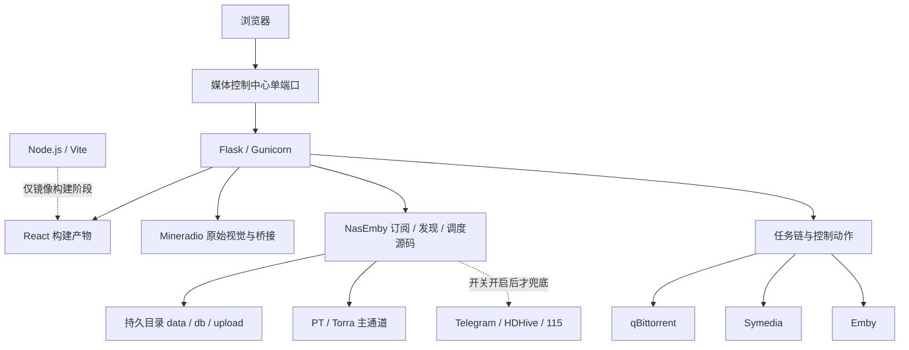

# Python 统一后端设计

状态：已实现（阶段 0 至阶段 8 完成；真实订阅闭环延后）
日期：2026-07-16
归档基线：`archive/pre-python-backend-unification-2026-07-16`
关联设计：

- `docs/superpowers/specs/2026-07-14-nasemby-source-merge-design.md`
- `docs/superpowers/specs/2026-07-14-dual-channel-subscription-center-design.md`
- `docs/superpowers/specs/2026-07-16-nasemby-core-production-runtime-design.md`

## 1. 决策

媒体控制中心最终统一为一套 Python 后端：Flask 提供全部同源 API、整站认证、React 静态资源和 Mineradio 桥接页，Gunicorn 作为 fnOS Docker 中的生产入口。React 前端继续保留；Mineradio 原始 HTML、JavaScript、Three.js 和 GSAP 视觉继续保留；Node.js 只在镜像构建阶段编译 React，不作为生产常驻进程。

最终部署目标是：

- 一个媒体控制中心 Docker 容器。
- 一个对用户开放的 HTTP 端口。
- 一个 Python/Gunicorn 常驻运行时。
- 一套订阅台账和一套调度器。
- 一套 React 页面，不嵌入或跳转到独立 NasEmby 页面。

## 2. 为什么选择 Python 统一

NasEmby 已经包含可运行的订阅、发现、日历、资源规则、调度、115、Telegram、HDHive 和 provider 逻辑，其中部分资产是 Python 专用依赖或受保护模块。把这些能力翻译成 Express 会重新制造第二套业务规则，风险和工作量都高于迁移当前 Express 门面。

当前 Express 的主要价值是认证、外部服务适配、任务链聚合、Mineradio 桥接和静态托管。这些属于边界清晰的 HTTP 与聚合逻辑，可以按现有 API 契约分阶段迁入 Flask。React 在浏览器运行，与后端语言无关；后端改成 Python 不会改变 React 页面或 Mineradio 的视觉效果。

## 3. 不做的事情

- 不把 React 改写成 Flask 模板、Vue、原生页面或其他前端框架。
- 不重写 Mineradio 原始视觉，不修改影院大厅、顶部导航和媒体队列的现有 UI。
- 不重新猜测或翻译 NasEmby 的订阅业务。
- 不在此次后端统一中引入 SQLite、PostgreSQL、Redis、Celery 或消息队列。
- 不导入外部 NasEmby 台账；用户仍从媒体控制中心创建订阅。
- 不让 Express 和 Python 同时写订阅、同时调度或同时触发 provider。
- 不在实机窗口前执行 Torra、qB、115、Symedia、Telegram、HDHive 或 Emby 的真实写动作。

## 4. 目标架构

为降低迁移风险，未搬动 `services/nasemby-core/` 的目录和 Python 模块边界，而是在该运行时中吸收原中控边界能力。Docker 服务已经统一为媒体控制中心；源码目录暂不重命名，避免为了目录外观制造大规模导入变更。

## 5. 前端保持方式

### React

React 继续负责总览、控制室、任务中心、日历、发现、订阅设置、系统设置、影院大厅外壳和媒体队列。现有 TypeScript 类型与 `src/services/api.ts` 继续作为浏览器端 API 契约，后端迁移原则上不要求页面改版。

### Mineradio

`vendor/mineradio-public/` 继续保存 Mineradio 原始资源。当前 Express 在 `/mineradio/embed` 注入的 base、样式、业务拦截和 `postMessage` 桥接必须按行为逐项迁到 Python，并使用相同输入输出做回归。迁移只更换提供页面的后端，不改视觉参数、Three.js 场景、封面粒子或 shelf 交互。

### 静态资源

Docker 使用多阶段构建：Node/Vite 阶段执行 React 生产构建，最终 Python 镜像只复制构建产物和 Mineradio 静态资源。fnOS 运行容器内不保留 Node.js，也不启动 `npm start`。

## 6. Python 后端职责

统一后的 Flask 应用承担：

1. 整站登录、HttpOnly 会话、Origin 校验、请求体限制和登录频率限制。
2. React SPA、静态资源、Mineradio 页面和资源的同源提供。
3. NasEmby 原订阅、发现、日历、资源搜索、配置和调度能力。
4. Emby、qBittorrent、Torra、Symedia 的服务端适配和凭据隔离。
5. 统一任务链聚合、qB 暂停/恢复和证据驱动的 Emby 刷新。
6. 健康检查、脱敏活动日志和错误状态标准化。

现有 Gunicorn 约束继续有效：单 `gthread` worker、四个 HTTP 线程、只启动一套后台调度器。若未来需要多 worker 或多副本，必须先解决调度选主和持久数据并发，不能直接增加 worker 数。

## 7. API 兼容策略

React 已使用的公开路径和响应结构默认保持不变，例如：

- `/api/auth/*`
- `/api/health`
- `/api/media/*`
- `/api/discover/*`
- `/api/subscriptions/*`
- `/api/tasks/chain`
- `/api/qbittorrent/*`
- `/api/torra/*`
- `/api/symedia/*`
- `/mineradio/embed`

47 条历史行为已固化为 v1 契约测试；Python 实现覆盖成功、离线、超时、认证失败、Origin 和错误脱敏。写接口禁止影子双写，也不自动重试。

## 8. 数据与持久化

本次统一不新建数据库。`db` 是 NasEmby 沿用的持久目录名称，当前订阅台账仍以其中的 JSON 文件为准，不代表已经建设了关系型数据库。

最终 Docker 把一个 fnOS 持久根目录映射给应用，并在其中保留 `data/`、`db/`、`upload/` 子目录。迁移现有 Node 运行状态时采用一次性、可核对的文件转换；订阅台账不转换、不复制，继续由 NasEmby 原源码维护。

必须满足：

- 生产订阅只写 `db/discover_subscription_items.json` 和 `db/discover_subscriptions.json` 等 NasEmby 原文件。
- Python 离线时不回退到旧 Node 台账写入。
- 调度器始终只有一套。
- 升级前备份整个持久根目录，回滚代码时不猜测合并数据。

## 9. 获取策略

- PT/Torra 是默认和主要订阅获取通道。
- 默认策略保持 `pt_only`。
- 自动云盘兜底总开关默认关闭。
- 开关开启后也只能在 PT 明确未命中或失败、且确认没有活动下载和重复入库时切换一次。
- 人工资源搜索可以独立使用，但转存前仍需确认和查重。
- `cloud_then_pt` 不进入首版目标。

## 10. 错误与安全边界

- 上游不可达时返回明确的服务不可用状态，不伪造成功或回退模拟数据。
- 写请求在服务端重新校验目标和当前状态；网络失败不自动重试。
- 日志不得包含密码、Token、Cookie、完整请求载荷或带查询凭据的 URL。
- 外部服务地址和凭据只来自环境变量或受保护的服务端配置。
- 认证必须先覆盖 React、Mineradio、静态资源和全部业务 API，再移除 Express。
- 实机写开关在用户确认测试窗口前保持关闭。

## 11. Docker 与 fnOS

最终 Dockerfile 使用 Node 构建阶段加 Python 运行阶段。生产镜像基于 Python 3.13 slim，使用 Gunicorn 启动统一 Flask 应用；Compose 只定义一个应用服务、一个宿主端口和持久根目录。健康检查直接访问统一后端，不再检查内部 Core 地址。

镜像可以在 CI 或其他机器构建后推送给 fnOS，也可以在 fnOS 上构建一次；无论采用哪种方式，运行中的容器都不执行 npm 构建，也不保留第二个常驻后端。

## 12. 回滚原则

- 本次迁移前快照由分支 `codex/pre-python-backend-archive` 和标签 `archive/pre-python-backend-unification-2026-07-16` 保存。
- 迁移提交与归档标签保留完整回滚证据。
- 发现问题时优先回退镜像，不回滚订阅数据。
- 旧运行后端已经删除；紧急恢复旧归档时必须先停止 Python 容器，不能同时对外监听或调度。

## 13. 完成标准

1. fnOS 只运行一个媒体控制中心容器和一个对外端口。
2. 容器常驻进程只有 Python/Gunicorn，不含 Node/Express 服务。
3. React、影院大厅、顶部导航和媒体队列视觉与归档基线一致。
4. 全部公开 API 契约、认证、任务链和安全动作通过回归。
5. 订阅、调度和 provider 只有 Python 一套实现。
6. 默认只走 PT/Torra，云盘自动兜底仍关闭。
7. 持久目录重启后数据保留，升级前后可备份和恢复。

实施步骤见：`docs/superpowers/plans/2026-07-16-python-backend-unification-implementation-plan.md`。

## 14. 实现结果（2026-07-17）

- 阶段 0 至阶段 8 完成。
- 单容器镜像构建、登录、React 静态托管、Python 健康、只读订阅、写闸门、legacy 404、无 Node 运行时和重启持久化均已本地验证。
- Express 源码、运行依赖、服务端 TypeScript 配置和旧 Node 后端测试已删除。
- 影院大厅、顶部导航、媒体队列和 Mineradio 原视觉未修改。
- 阶段 9 未执行；真实订阅、Torra 搜索、qB 动作、115/Symedia 转存和 Emby 刷新均未触发。
